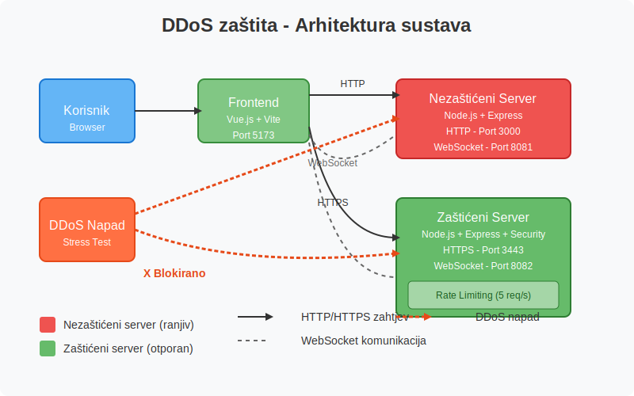

# DDoS zaštita - Demo prezentacija

## Sadržaj
1. [Uvod](#uvod)
2. [Arhitektura sustava](#arhitektura-sustava)
3. [Backend sustav](#backend-sustav)
   - [Nezaštićeni server](#nezaštićeni-server)
   - [Zaštićeni server](#zaštićeni-server)
   - [Sigurnosne mjere](#sigurnosne-mjere)
4. [Frontend aplikacija](#frontend-aplikacija)
   - [Struktura aplikacije](#struktura-aplikacije)
   - [Glavni prikazi](#glavni-prikazi)
5. [WebSocket komunikacija](#websocket-komunikacija)
6. [Demo scenariji](#demo-scenariji)
7. [Zaključak](#zaključak)

## Uvod

Ovaj projekt demonstrira razliku između zaštićenog i nezaštićenog web servera pri simuliranom DDoS napadu (Distributed Denial of Service). Kroz interaktivno sučelje možemo vidjeti kako različite zaštitne mjere utječu na otpornost servera pri povećanom broju zahtjeva.

## Arhitektura sustava

Naš demo sustav sastoji se od 3 glavna dijela:

1. **Nezaštićeni backend server** (Node.js + Express) - Port 3000

2. **Zaštićeni backend server** (Node.js + Express + sigurnosne mjere) - Port 3443 (HTTPS)

3. **Frontend aplikacija** (Vue.js) - Port 5173

   




## Backend sustav

### Nezaštićeni server

**Port:** 3000 (HTTP)
**Putanja:** `/home/tin/Documents/DDoS-javascript/backend/unprotected.js`

Nezaštićeni server je namjerno ranjiv na DDoS napade jer:
- Nema ograničenja broja zahtjeva (rate limiting)
- Nema HTTPS enkripciju
- Nema zaštitu zaglavlja (header protection)
- Izvršava resursom intenzivne operacije bez optimizacije

#### Ključne komponente:

```javascript
const express = require("express");
const cors = require("cors");
const WebSocket = require("ws");

// Stvaranje Express aplikacije
const app = express();
app.use(cors());
app.use(express.json());

// WebSocket server za praćenje prometa
const wss = new WebSocket.Server({ port: 8081 });
```

#### Glavni endpointi:

1. **`/unprotected`** - Standardni endpoint koji simulira opterećenje
2. **`/heavy`** - Endpoint koji izvršava još zahtjevnije operacije

#### Primjer zahtjevnog endpointa:

```javascript
// Ruta koja simulira tešku operaciju (vrlo osjetljiva na DDoS)
app.get("/heavy", (req, res) => {
  const startTime = Date.now();
  
  // Simulacija vrlo teške operacije
  let result = 0;
  for(let i = 0; i < 5000000; i++) {
    result += Math.sqrt(Math.random() * i);
  }
  
  const processingTime = Date.now() - startTime;
  
  broadcast({ 
    type: "heavy", 
    message: "Težak zahtjev obrađen", 
    processingTime: processingTime,
    timestamp: Date.now()
  });
  
  res.json({
    status: "success",
    message: "Teška operacija završena",
    processingTime: processingTime + "ms"
  });
});
```

### Zaštićeni server

**Port:** 3443 (HTTPS)
**Putanja:** `/home/tin/Documents/DDoS-javascript/backend/protected.js`

Zaštićeni server implementira više sigurnosnih mjera:
- HTTPS protokol
- Rate limiting (ograničenje broja zahtjeva)
- CORS zaštita
- Helmet middleware za HTTP zaglavlja
- Optimizirane operacije pri obradi zahtjeva

#### Ključne komponente:

```javascript
const https = require('https');
const fs = require('fs');
const express = require('express');
const cors = require('cors');
const rateLimit = require('express-rate-limit');
const helmet = require('helmet');
const WebSocket = require("ws");

// CORS konfiguracija
app.use(cors({
  origin: ['http://localhost:5173', 'http://localhost:3000'],
  methods: ['GET', 'POST', 'OPTIONS'],
  credentials: true,
  allowedHeaders: ['Content-Type', 'Authorization']
}));
```

#### Implementacija rate limitera:

```javascript
// Rate limiter - ograničava broj zahtjeva po IP adresi
const limiter = rateLimit({
  windowMs: 1000, // 1 sekunda
  max: 5, // maksimalno 5 zahtjeva po sekundi
  standardHeaders: true,
  legacyHeaders: false,
  handler: (req, res, next) => {
    blockedCount++;
    broadcast({ 
      type: "blocked", 
      ip: req.ip,
      timestamp: Date.now()
    });
    res.status(429).json({
      status: "error",
      message: "Previše zahtjeva. Molimo pokušajte ponovno kasnije."
    });
  }
});

// Globalni rate limiter za sve rute
app.use(limiter);
```

### Sigurnosne mjere

Usporedba sigurnosnih mjera između dva servera:

| Sigurnosna mjera | Nezaštićeni server | Zaštićeni server |
|------------------|-------------------|-----------------|
| Rate limiting | ❌ | ✅ (5 zahtjeva/s) |
| HTTPS | ❌ | ✅ |
| CORS zaštita | ❌ | ✅ |
| HTTP zaglavlja (Helmet) | ❌ | ✅ |
| Optimizirana obrada | ❌ | ✅ |

## Frontend aplikacija

**Port:** 5173 (Vite razvojni server)
**Glavne komponente:**
- `UnprotectedView.vue` - Prikaz za interakciju s nezaštićenim serverom
- `ProtectedView.vue` - Prikaz za interakciju sa zaštićenim serverom

### Struktura aplikacije

Frontend aplikacija koristi Vue.js okvir i sastoji se od dvije glavne stranice za interakciju s različitim serverima. Za komunikaciju koristi:
- Axios za HTTP zahtjeve
- WebSocket za primanje podataka o prometu u stvarnom vremenu
- Vite proxy konfiguraciju za preusmjeravanje zahtjeva

#### Vite proxy konfiguracija:

```javascript
// vite.config.js
export default defineConfig({
  plugins: [vue()],
  server: {
    proxy: {
      '/api/protected': {
        target: 'https://localhost:3443',
        changeOrigin: true,
        secure: false,
        rewrite: (path) => path.replace(/^\/api\/protected/, '/protected')
      },
      '/api/unprotected': {
        target: 'http://localhost:3000',
        changeOrigin: true,
        rewrite: (path) => path.replace(/^\/api\/unprotected/, '/unprotected')
      },
      // ...ostali proxyji...
    }
  }
});
```

### Glavni prikazi

#### Nezaštićeni prikaz (`UnprotectedView.vue`):
- Gumb za slanje pojedinačnog zahtjeva
- Gumb za pokretanje stress testa (mnogo zahtjeva)
- Prikaz statistike uspješnih zahtjeva
- Prikaz odgovora servera
- Prikaz stvarnovremenskih log zapisa primljenih preko WebSocketa

#### Zaštićeni prikaz (`ProtectedView.vue`):
- Isto kao nezaštićeni prikaz + dodatne funkcionalnosti
- Brojač blokiranih zahtjeva
- Postotak uspješnosti zahtjeva
- Prikaz heavy zahtjeva koji simulira još intenzivniju obradu

## WebSocket komunikacija

Oba servera koriste WebSockete za slanje podataka o prometu u stvarnom vremenu:

1. **Nezaštićeni server** - WebSocket na portu 8081
2. **Zaštićeni server** - WebSocket na portu 8082

### Primjer implementacije WebSocket komunikacije:

**Backend:**
```javascript
// WebSocket server za praćenje prometa
const wss = new WebSocket.Server({ port: 8082 });

function broadcast(data) {
  wss.clients.forEach(client => {
    if (client.readyState === WebSocket.OPEN) {
      client.send(JSON.stringify(data));
    }
  });
}
```

**Frontend:**
```javascript
const connectWebSocket = () => {
  ws = new WebSocket("ws://localhost:8082");
  
  ws.onopen = () => {
    addLog({
      type: "system",
      message: "WebSocket povezan s protected serverom",
      timestamp: Date.now()
    });
  };

  ws.onmessage = (event) => {
    const data = JSON.parse(event.data);
    addLog(data);
    
    if (data.type === "blocked") {
      blockedCount.value++;
    }
  };
};
```

## Demo scenariji

Tijekom prezentacije možemo demonstrirati sljedeće scenarije:

### Scenarij 1: Pojedinačni zahtjevi na oba servera
1. Pošaljite zahtjev na nezaštićeni server
2. Pošaljite zahtjev na zaštićeni server
3. Usporedite vrijeme obrade i odgovore

### Scenarij 2: Stress test na nezaštićeni server
1. Pokrenite stress test na nezaštićeni server
2. Promatrajte kako server odgovara pod povećanim opterećenjem
3. Pratite vrijeme obrade koje će se vjerojatno povećavati

### Scenarij 3: Stress test na zaštićeni server
1. Pokrenite stress test na zaštićeni server
2. Primijetite kako rate limiter blokira prekomjerne zahtjeve (429 status)
3. Usporedite stabilnost i brzinu odgovora sa nezaštićenim serverom

### Scenarij 4: Teški zahtjevi
1. Pošaljite "heavy" zahtjev na nezaštićeni server
2. Pošaljite "heavy" zahtjev na zaštićeni server
3. Usporedite vrijeme obrade i utjecaj na performanse servera

## Zaključak

Ova demonstracija pokazuje:

1. **Važnost implementacije rate limitinga** - Osnovna ali učinkovita mjera protiv DDoS napada
2. **Prednosti HTTPS protokola** - Dodatni sloj sigurnosti
3. **Učinkovitost pravilno konfiguriranih CORS postavki** - Kontrola pristupa resursima
4. **Vrijednost optimizacije resursa** - Smanjenje utjecaja zahtjevnih operacija

Implementacijom ovih sigurnosnih mjera možemo značajno poboljšati otpornost web aplikacije na DDoS i druge vrste napada.

---

## Dodatni tehnički detalji

### Korištene tehnologije:
- **Backend**: Node.js, Express.js
- **Frontend**: Vue.js 3, Vite
- **Komunikacija**: Axios, WebSockets
- **Sigurnost**: Helmet, express-rate-limit, HTTPS

### Pokretanje aplikacije:

```bash
# Terminal 1 - Pokreni nezaštićeni server
cd /home/tin/Documents/DDoS-javascript/backend/
node unprotected.js

# Terminal 2 - Pokreni zaštićeni server 
cd /home/tin/Documents/DDoS-javascript/backend/
node protected.js

# Terminal 3 - Pokreni frontend
cd /home/tin/Documents/DDoS-javascript/frontend/
npm run dev
```

Nakon pokretanja, frontend aplikacija dostupna je na `http://localhost:5173`